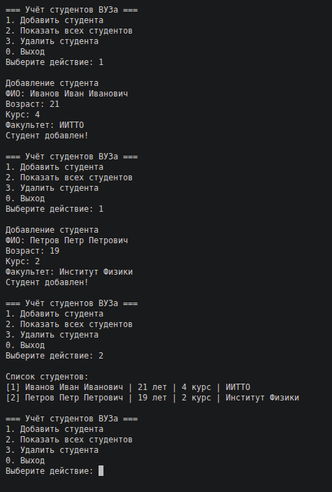

# Отчёт
## Mind-map

## Методы и методология

### Постановка задачи
Разработать простую базу данных для учёта обучающихся (SQL + интерфейс). Реализовать взаимодействие с пользователем через терминал.

### Выбранная методология
* Выбрана каскадная модель разработки (Waterfall model)

### Этапы реадизации
1. Выбор методологии
2. Разработка модели базы данных
3. Выбор средств реализации и зависимостей
4. Создание программы
5. Тестирование

### Использованные методы
* Определение требований
* Проектирование
* Конструирование
* Воплощение
* Тестирование и отладка

## Пример работы программы

